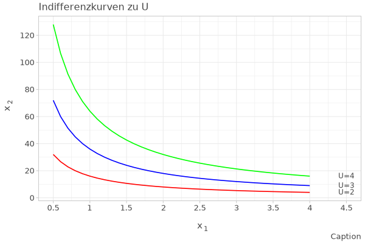
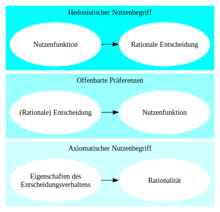
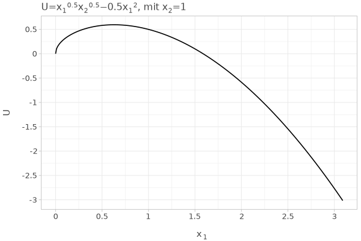
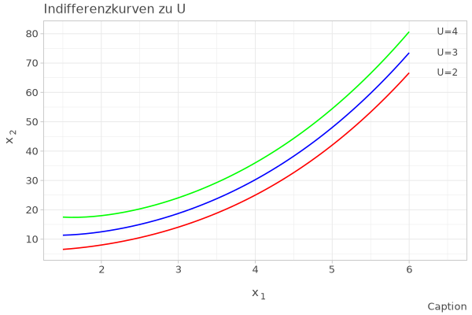

# Effizienz und Rationalität 

## Individuelles Entscheidungsproblem

::: {.callout-note icon="false" collapse="false"}
# Kernbotschaft {-}
Individuell rationales Verhalten führt zu individuell effizienzten Ergebnissen. Dies ist eine Frage der Definition der Rationalität und der Effizienz. 
:::


```{r}
#| warning: false
#| message: false
#| fig-cap: "Raionalitätskonzepte in der Ökonomik"


# Falls noch nicht installiert:
# install.packages("DiagrammeR")

library(DiagrammeR)

grViz("
digraph RationalitaetsKonzepte {
  # Allgemeine Attribute
  graph [rankdir = TB, compound = true, nodesep = 0.5, ranksep = 0.5]
  node [fontname = Arial, fontsize = 11, style = filled, shape = rectangle]

  # 1. Das Fundament: Ökonomisches Prinzip
  subgraph cluster_eco_principle {
    label = 'Das Ökonomische Prinzip (Vermeidung von Verschwendung)'
    style = filled
    color = lightgrey
    fillcolor = '#f9f9f9'
    
    Max [label = 'Maximalprinzip\n(Gegebener Input -> Max. Erfolg)', fillcolor = '#E3F2FD']
    Min [label = 'Minimalprinzip\n(Fixes Ziel -> Min. Aufwand)', fillcolor = '#E3F2FD']
  }

  # 2. Das klassische Modell
  subgraph cluster_homo {
    label = 'Leitbild: Homo Oeconomicus'
    color = '#1976D2'
    fontcolor = '#1976D2'
    
    HO [label = 'Vollkommene Rationalität\nLückenlose Info\nEgoistische Nutzenmaximierung', 
        shape = doubleoctagon, fillcolor = '#BBDEFB']
  }

  # 3. Formale/Axiomatische Rationalität
  subgraph cluster_axioms {
    label = 'Axiomatische Rationalität (Konsistenz)'
    color = '#388E3C'
    fontcolor = '#388E3C'
    
    Trans [label = 'Transitivität\n(A > B, B > C => A > C)', fillcolor = '#C8E6C9']
    Comp [label = 'Vollständigkeit\n(Alle Optionen vergleichbar)', fillcolor = '#C8E6C9']
  }

  # 4. Die Realität: Beschränkte Rationalität
  subgraph cluster_bounded {
    label = 'Beschränkte Rationalität'
    color = '#F57C00'
    fontcolor = '#F57C00'
    
    Sat [label = 'Satisficing\n(Anspruchsniveau erfüllen statt optimieren)', fillcolor = '#FFE0B2']
    Heur [label = 'Heuristiken & Biases\n(Systematische Fehlentscheidungen)', fillcolor = '#FFE0B2']
  }

  # 5. Soziale & Philosophische Dimension
  PD [label = 'Gefangenendilemma\n(Individuelle vs. Kollektive Rationalität)', 
      shape = component, fillcolor = '#FFCDD2']
  Instr [label = 'Instrumentelle Rationalität\n(Wahl der Mittel)', fillcolor = '#D1C4E9']
  Subst [label = 'Substanzielle Rationalität\n(Reflektion der Ziele)', fillcolor = '#D1C4E9', penwidth = 2]

  # Verbindungen
  HO -> Max [style = dashed]
  HO -> Min [style = dashed]
  HO -> PD [label = ' führt zu Ineffizienz in...']
  
  # Kritik-Pfeil (Richtung umgekehrt wie im Python 'dir=back')
  Sat -> HO [label = ' Kritik durch', color = red, arrowhead = none]

  Trans -> HO [label = ' Axiome für']
  Comp -> HO

  Instr -> Subst [label = ' 2. Stufe der Rationalität']
  Subst -> Sat [label = ' erkennt Grenzen an', style = dotted]
}
")
```


Das Folgende ist fast wörtlich aus @Detel07_Soz S. 20 übernommen.

### Basisschema der Handlungserklärung

1. Person $S$ wünscht, Ziel $Z$ zu realisieren.

2. $S$ glaubt, die Handlung $H$ sei ein Mittel, um $Z$ zu realisieren.

3. **$S$ vollzieht Handlung $H$**. 


Das Basisschema ist noch unvollständig:

- Was ist, wenn es für $S$ bessere Handlungen als $H$ gibt, $Z$ zu
realisieren? Dann wäre es nicht vernünftig, $H$ zu vollziehen.
-  Was ist, wenn es $S$ $H$ gar nicht vollziehen kann?
-  Was ist, wenn $H$ mit negativen Folgen einhergeht, die schlimmer
sind, als $Z$ nicht zu realisieren?
-  Was ist, wenn $S$ noch weitere Ziele realisieren will, die mit $Z$
nicht vereinbar sind?

$\Rightarrow$ **erweitertes Schema der Handlungserklärung**


### Erweitertes Schema der Handlungserklärung

1. $S$ hat die Absicht, Ziel $Z$ zu realisieren.

2. $S$ glaubt, dass, wenn sie Handlung $H$ vollzieht, sie somit $Z$
realisieren kann.

3. $S$ glaubt in der Lage zu sein, $Z$ zu realisieren und $H$ zu vollziehen.

4. $S$ weiß, wie man $Z$ realisiert und $H$ vollzieht.

4. $S$ glaubt nicht, dass es etwas Besseres gibt als $H$, um $Z$ zu
realisieren.

5. $S$ glaubt nicht, dass der Vollzug von $H$ Folgen hat, die schlimmer
sind als nicht $Z$ realisieren zu können.

6. $S$ hat nicht die Absicht, ein Ziel zu realisieren, von dem $S$
weiß, dass es unvereinbar damit ist, $Z$ zu realisieren, und das
sie $Z$ gegenüber vorzieht.

7. **$S$ vollzieht Handlung $H$.**

### Zwischenfazit

- Erklärungen rationaler Handlungen unterstellen nicht zwangsläufig,
dass die handelnde Person "alles richtig"  macht. 
-  Insbesondere lässt es beschränkte Handlungsmöglichkeiten zu und unvollständige
oder fehlerhafte Informationslagen.
- Das **Rationalprinzip** ist weniger eine Behauptung über die handelnde
Person, sondern ein Schema, eine **"Grammatik" der Erklärung**.

:::{.callout-note 
    icon=false 
    collapse=true }
# Rationalitätsannahme und Intuition/implizites Wissen {-} 

<iframe width="560" height="315" src="https://www.youtube-nocookie.com/embed/l1ZnWc-sFd0?si=QYyCtZqroT568_sy&amp;start=335" title="YouTube video player" frameborder="0" allow="accelerometer; autoplay; clipboard-write; encrypted-media; gyroscope; picture-in-picture; web-share" referrerpolicy="strict-origin-when-cross-origin" allowfullscreen></iframe>

"Now, before everybody starts saying, 'Well, Kurt Cobain didn't really know what he's doing...' that doesn't matter. **I** know what he's doing, and I'm going to tell you what he's doing. That's really the essence of this. **It doesn't matter if people know what they're doing if they can just do it intuitively**." (Rick Beato)
:::


### Rationales Handeln als Nutzenmaximierung


- Darstellung der Ziele eines Individuums mittels Nutzenfunktionen: $U=U(x_1, x_2, \dots, x_n)$.

- Der Nutzen hängt ab von den konsumierten Gütern oder sonstigen Umständen $x_i$

- Zur Vereinfachung: Beschränkung auf wenige Güter


- Ein Beispiel: $U(x_1, x_2)=\frac{1}{2} \sqrt{x_1\times x_2}$

#### 3D-Darstellung: Nutzengebirge und Indifferenzkurven als Projektion der Höhenlinien

```{r}
#| message: false
#| warning: false
#| output: false
#| include: true

library(tidyverse)
library(plotly)

f <- function(x1, x2){x1+x2}

x1a <- 0
x1b <- 100

x2a <- 0
x2b <- 100

x1 <- seq(x1a, x1b)
x2 <- seq(x2a, x2b)  


f <- function(x1, x2){.5*(x1*x2)^.5}


u <- outer(x1, x2, f)

p <- plot_ly(z = u, type = "surface", opacity=.5) %>%
 #
  layout(scene = list(xaxis = list(title ="x<sub>1</sub>", showticklabels = FALSE), yaxis = list(title = "x<sub>2</sub>", showticklabels = FALSE), zaxis = list(title = "U", showticklabels = FALSE))) %>%
   config(displaylogo = FALSE,
          scrollZoom = F) %>%            add_surface(
      contours = list(
      z = list(
      show=T,
      usecolormap=T,
      highlightcolor="#ff0000",
      project=list(z=TRUE)
      )
    )
  )%>% layout(
    scene = list(
      camera=list(
        eye = list(x=-1, y=-2, z=.2)
        )
      )
  )%>% 
  hide_colorbar()


```

```{r}
#| warning: false
#| message: false
#| fig-cap: "Ein Nutzengebirge"
#| 
p
```


#### 2D-Darstellung: Indifferenzkurven

```{python}
#| message: false
#| warning: false
#| output: false

from lets_plot import *
import numpy as np
from sympy import symbols, Eq, solve, lambdify, latex

# Setup Lets-Plot for HTML output
LetsPlot.setup_html()

# Define the symbols and the equation
x1, x2, U = symbols('x1 x2 U')
equation = Eq(U,.5*(x1*x2)**.5)

# Solve for x2 and lambdify the solution
solution_x2 = solve(equation, x2)[0]
x2_func = lambdify((x1, U), solution_x2)

# Define specific values for U
U_value = 3
U_values = [U_value - 1, U_value, U_value + 1]
colors = ['red', 'blue', 'green']
labels = ['U=2', 'U=3', 'U=4']

# Create data with values from 0 to 6 in steps of 0.1
x_values = np.arange(.5, 4.1, 0.1)
data = {'x': x_values.tolist()}

# Initialize the plot
plot = ggplot()

# Add curves using a loop and annotate each curve
for i, u in enumerate(U_values):
    plot += geom_function(aes('x'), data=data, fun=lambda t, u=u: x2_func(t, u), color=colors[i])
    # Annotate each curve at a specific point (e.g., x=4)
    y_value = x2_func(4, u)
    plot += geom_text(x=4.5, y=y_value, label= labels[i], size=6
)

# Add title and labels
plot += ggtitle(f'Indifferenzkurven zu U') + \
        labs(x='\( x_1 \)', y='\(x_2\)', caption='Caption') + \
        theme_light()

# Display the plot
# plot.show()

ggsave(plot, filename='plot.svg')
```



#### Indifferenzkurven und Budgetrestriktionen

Nutzenfunktion: $U(x_1, x_2)=x_1\times x_2$

Indifferenzkurve: $x_2=\frac{\bar{U}}{x_1}$

Budgetrestriktion: $I=p_1 x_1+p_2 x_2$

Budgetlinie: $x_2=\frac{I}{p_2}- \frac{p_1}{p_2}x_1$


```{r}
#| message: false
#| warning: false
#| fig-cap: "Indifferenzkurven und Budgetrestriktionen"


# Bibliotheken laden
library(tidyverse)
library(latex2exp)

# Funktionen definieren

x <- 0:10

I_1 <- function(x) 10/x
I_2 <- function(x) 25/x
I_3 <- function(x) (5*7.5)/x

b1 <- function(x) 10-x
b2 <- function(x) 10-(2/3)*x


#Gleichgewichtsmenge x1^0
x10 <- uniroot(function(x) -25/x^2 + 1, range(x))$root

#Gleichgewichtsmenge x20

x20 <- b1(x10)

#Gleichgewichtsmenge x1^1
x11 <- uniroot(function(x) -(5*7.5)/x^2 + 2/3, range(x))$root


# Chart

chart <- ggplot() +
  stat_function(aes(color = "I_1"), fun = I_1, xlim = c(uniroot(function(x) I_1(x) - 18, range(x))$root,18))+
   annotate(geom = "text", x=18, y=I_1(18), hjust=-0.4, label=expression(I[1]),color = "grey30")+
  #
  stat_function(aes(color = "I_2"), fun = I_2, xlim = c(uniroot(function(x) I_2(x) - 18, range(x))$root,18)) +
   annotate(geom = "text", x=18, y=I_2(18), hjust=-0.4, label=expression(I[2]),color = "grey30")+
  #
  stat_function(aes(color = "I_3"), fun = I_3, xlim = c(uniroot(function(x) I_3(x) - 18, range(x))$root,18)) +
  annotate(geom = "text", x=18, y=I_3(18), hjust=-0.4, label=expression(I[3]),color = "grey30")+
  #
  stat_function(aes(color = "budget"), fun = b1, xlim=c(0,10))+
  stat_function(aes(color = "budget"), fun = b2, linetype="dashed", xlim=c(0,15))+
  #
  annotate("segment", x = x10, xend = x10, y = 0, yend = x20,
           linetype = "dashed") +
  #
  annotate("segment", x = 0, xend = x11, y = x20, yend = x20,
           linetype = "dashed") +
  #
  annotate("segment", x = x10, xend = x10, y = 0, yend = x20,
           linetype = "dashed") +
  #
    annotate("segment", x = x11, xend = x11, y = 0, yend = x20,
           linetype = "dashed") +
  #
  scale_color_manual(values=c("red", "green", "green", "green"))+
  #scale_fill_manual(values=c("green", "orange"))+
  scale_x_continuous(expand = c(0, 0), 
                    breaks = c(0, x10, x11, 10, 15), labels = expression("0",x[1]^0, x[1]^1, frac(I^0, p[1]^0), frac(I^0, p[1]^1) ),
                     limits = c(0, 20)) +
  scale_y_continuous(expand = c(0, 0), 
                     breaks = c(0,x20, 10), labels = c("0", latex2exp::TeX(r"($x_2^0=x_2^1$)"), latex2exp::TeX(r"($\frac{I^0}{p_1^0}$)") ),
                     limits = c(0,20)) +
  theme_classic() +
  theme(panel.grid = element_blank(),
        legend.position = "none", #Damit Legende unterdrückt.
       ) +
  theme(axis.line = element_line(arrow = arrow(type='closed', length = unit(5,'pt'))))+
  labs(title= "Indifferenzkurven und Budgetrestriktionen",
      x = latex2exp::TeX(r'($x_1$)'),
      y = latex2exp::TeX(r'($x_2$)'), 
      color = NULL, fill = NULL)
chart

```

#### Das Verhältnis zwischen Rationalität und Nutzenmaximierung

- Unter Sicherheit führt rationales Verhalten individuell zu effizienten Ergebnissen.

- Wodurch sich die individuell effizienzten Ergebnisse auszeichnen, hängt von der Beschaffenheit der Nutzenfunktion ab.

```{r}
#| message: false
#| warning: false
#| fig-cap: Indifferenzkurven unterschiedlicher Nutzenfunktionen

library(ggplot2)

ggplot() +
  xlim(c(0.8, 3)) +
  ylim(c(0, 2))+
  geom_function(fun = function(x) 1/x, colour = "blue", lwd = 1) +
  geom_function(fun = function(x) 1/x^(.7/.3), colour = "red", lwd = 1) +
  geom_function(fun = function(x) 1/x^(.45/.3), colour = "grey", lwd = 1) +
  geom_point(aes(x = 1, y = 1), size = 3) + # Add a red point at (1,1)
  geom_text(aes(x = 1, y = 1, label = "A", vjust = -1)) + # Add label for the first point
  geom_point(aes(x = 2, y = 1/2^(.45/.3)), size = 3) +
  geom_text(aes(x = 2, y = 1/2^(.45/.3), label = "B", vjust = -1)) + # Add label for the second point
 # geom_text(aes(x = 3, y = 1/3, label = "y = 1/x^2.5"), hjust = 1, vjust = 2.5) + # Label for the red curve
 # geom_text(aes(x = 3, y = 1/3, label = "y = 1/x"), hjust = 1, vjust = -1) + # Label for the blue curve
  theme_light()+
  labs(x=expression(x[1]), y = expression(x[2]), title = "Indifferenzkurven unterschiedlicher Nutzenfunktionen")
```

**Hedonistischer Nutzenbegriff**: *Weil* die blaue Indifferenzkurve deine Nutzenfunktion repräsentiert, bevorzugst du $A$ gegenüber $B$.

**Offenbarte Präferenzen**: *Weil* du $A$ gegenüber $B$ bevorzugst, ist deine Nutzenfunktion durch die blaue Indifferenzkurve besser repräsentiert als durch die rote.

**Axiomatischer Nutzenbegriff**: Wenn du jeden denkbaren Punkt $A$ mit jedem denkbaren Punkt $B$ vergleichen kannst, sodass immer in transitiver Weise entweder gilt $A \succeq B$, $A \preceq B$ oder beides, dann lässt sich die Entscheidung als rationale Nutzenmaximierung beschreiben.

```{python}
#| warning: false
#| message: false
#| output: false

from graphviz import Source
from IPython.display import display

dot = '''
digraph clusters_example {
  graph [rankdir=LR]

  node [style=filled, color=white, fixedsize=true, width=2.5, height=1.2]

  subgraph cluster_3 {
    style=filled; color="#00ffff30"
    c1 [label="Eigenschaften des\n Entscheidungsverhaltens"]
    c2 [label="Rationalität"]
    c1 -> c2
    label = "Axiomatischer Nutzenbegriff"
  }

  subgraph cluster_2 {
    style=filled; color="#00ffff65"
    b1 [label="(Rationale) Entscheidung"]
    b2 [label="Nutzenfunktion"]
    b1 -> b2
    label = "Offenbarte Präferenzen"
  }

  subgraph cluster_1 {
    style=filled; color="#00ffff"
    a1 [label="Nutzenfunktion"]
    a2 [label="Rationale Entscheidung"]
    a1 -> a2
    label = "Hedonistischer Nutzenbegriff"
  }
}
'''

src = Source(dot)
# display(src)

#Datei erzeugen 
src.format = 'svg'  # Format setzen
src.render(filename='Rationalitaet', cleanup=True)  # Erzeugt output.svg
```




## Gesellschaftliches Entscheidungsproblem

:::{.callout-note 
    icon=false}
    
# Kernbotschaft {-}
Individuell rationales Verhalten kann, muss aber nicht zu gesellschaftlich effizienten Zuständen führen. 
:::


### Pareto-Verbesserungen und Pareto-Effizienz

***
Eine **Pareto-Verbesserung** liegt vor, wenn es möglich ist, den Nutzen mindestens eines Individuums zu steigern, ohne gleichzeitig den Nutzen eines anderen Individuums senken zu müssen.

Wenn keiene Pareto-Verbesserungen mehr möglich sind, liegt **Pareto-Effizienz** vor.

***


<iframe src="https://shinylive.io/r/app/#code=NobwRAdghgtgpmAXGKAHVA6ASmANGAYwHsIAXOMpMAGwEsAjAJykYE8AKAZwAtaJWAlAB0IIgMQACALQyJARgwSAqgElpMkQFdaEgDxSJAM2raAJgAUoAczjsREiaVqlqcSxDjU7YAKKmbAO5EjKTcUgBCRAAeQmACuPYSnLSmcPQsADJQrESapHYQDg7JqemM7p4FRUWcdKmMKhCoed5Q1KjcUAD6AIKxuBKxPe2dEj0S7ADiefICiP0SAAwYiwCsA8sAnOtLGADMGyur8YnVtSlwDU0tsW0d3eELQyNQEuET06Sz83i7a4fbQ4ANkOaxOhWqEm4jHY4MhSTql0azXysQCcl6TzAPU0nE4pCgpFImggVgkn3kEx6cwWyzkA02GE2AwATCtDnI4ZDzvVkTcwAEWZjfkNcfjCcTSeSZiyqTTfnSGUyBgAOdm7TmnCRchwwKB8CpeVDUIikADyeRR3jg-jgQRC3HMJtIC24cFoVm4XwAvIMwEDFotUDFfgEUqEJL7YgGgyGBMIIQmE+J1AY2RIAMqXABul1TIk4Obz+iMJIIThI7D4KIGuVIKIEEhAiTrKIAJDbAsFQk7TXoDIwKPVe-lmxCHJJLMx4ORGFqABpdUh9ktyRYAbgkAE0lyuDGutVBxiXq3k23dOr1N1B3ifrqRzy8uo9xxJ0ceDKeH+ir2+WR+JC-NtBUxV8tUkAAxEkAGsKw8URXyUADDDLOD2CiAZBAkKIAD0jwkAAqCRWBw9g5CkI8E2qJRbwMFCIHLWhKww4jG1wm9COI0jyJvKiiiQrpOH7ZQenYd8BkFaktRowThJo9hF2XL4DHE7dd2Uv8pLA19JEmRgUiMAAfxgJAAaRIYlB0KLUomEwsAEd2GWRZ6QkRlNmZCRXFJUIMDrSMJAAFkDPiHFYOy4Ec5zXPczzvKsXz-N9YLFlCiQAC9emEutLnQzCBiQtLMvCLpmACbK8lyljWAGejGOYzDG3kxTTSkFidyUqRBDS8CJBHTM4GJVAtVQFh2D1EzfQIdgdh2QKBmONLjVNdgADkegGKI6Bgb1psWXAWtIeJiO23anNwDrTWOraoHob04CiVBBzxJiIHQ4A5AAXRw6lMOoW77se57kmY4AWW+37BlfSE9T4b1Yj8LsHQiaIFigThUG9VyoCiOBOG9CCegyDMfDSnHaE4MiBGvKIKfYFlqYkeholhLVeoAFSgXECG4OgIELD4iGoVIPAkCDqAAE55uA0r1ThoOE9hMvGAA+X0BM4RsADIJmK0qoHKtXlBKzWtVoPUbDy4iBjl6CBmIagzvWgZGCsegyMOFV5qWQ5AvjAYoFMUxvXZrAlFJtmdIkTnSQoJw7hg8gJBJUwJFW2hcy5oT6EuOAefgrUCVjhjWC6WzV0QTZC6gYuCFL8KS3YCYeOpAibwIw6CKLmwS7L7UJAAegmCQjwIsiKPCAQO-UiQAGoJhvCjW+7ig677nqo4ACVoPNRpey4vlMHeJAAWWsHfEAkAB1WgTJzwd84oCQj7gCQfHnHpTPZnxVr6iXGGloUQwxkxjJwgKnd4Ndn5P3CJcQy0ISRWAxonCgWpXC5moJwLKJYkLsBXr3Fi+C16CDQXADBWDaLGwUjPAwRDS7tRoY4GuPdiEb2qJIRoR9DCGFzhAdK0FNCMFzIUdK7pH7WVfMQMguQYTVQGMrAOQcQ5hx8AMUwZV-o50wQTImJN7ZC3hmAfEcBPD0BMHABY1AAjB2WCqAY6DPD4wcZg3oaUpHLkEVbGqGVnz6wCIo4Oodw5qI0bdRxOjiaqIkA7Qxhhb5pH0gQaCljrHelsfYsh4TnEULYUUSQGYCQhCkJw2g3DeH8MEcIiYR8klQhzMEGw3AiA5wgG4iyMivHyN6Bk8h3oNYBOUcE6JBjYimBYNBMxmgLG-CscHA4z9QlaPxoTSJbTpGeLkT4kqZUenhJkpwAZQSokxNGeMwcpgUlzJCQbTR4SVkk1yROMyFlmCwQEUI1+phBE80aUODKYjuAF0kQQPuJYHLnQkIdDkbiQUNwME3celE27hGnkpAiBAQW2UbEPJuo9EWT1RX2ee7BF5IoxevNBfA8bsHJSxcl3jZnehZPox2sQzFQCSbER5kgY493ju0FBI9NCGGgSZcyZBXmkHebmCQ7o+EAvghMTgPMAgsFEX1FBoVJCoCIHwUglM6FlwGIa7xqAeZYxBMM1lYB2Wct+AQB6WMMAM0juwsYYoCREkQcgiAsEJhWEYIZUWWAubkCWrqsglNVKSQGGa7gWNPJanhFa2JwQ8akADSY0Q9rHUuu0m6rMAjwH-1fj0HmhZCjsHMJcTgJA3hk1ppTeZhI0mIDXPYsJ2i1yIH2lajA5N8axDiYOJgtA7Wy3IFEfID0np4xBm9KIH1vqTwGCUOA3p5l83XWyHYJywDDoSWO5JcRDyNvYN7Ftiw229tuV2q9vaHb9sbbE+Jo7x1ahgJO6dQM52vXeuDHCK6kgXG9N7LdTKMC7pGfu19iTj18QAL4JgQyIAsvB+A9HQOwbQq6iyMATGABDn0gA" width="100%" height="800" title="Interaktives Solow-Modell">

</iframe>


- Welche Allokationen von $x_1$ und $x_2$ effizient sieht, lässt sich nur vor dem Hintergrund der jeweiligen Nutzenfunktionen beurteilen

- Entweder müssen die Nutzenfunktionen dafür bekannt sein, oder man muss davon ausgehen können, dass sich die Gleichgewichte aus freiwilligen Tauschprozessen ergeben.

### Auswahl zwischen verschiedenen effizienten Zuständen

- Eine Entscheidung zwischen verschiedenen effizienten Zuständen ist unter Umständen normativ sehr relevant.

- Hierfür müssen dann weitere Kriterien herangezogen werden, wie beispielsweise Vorstellungen über Gerechtigkeit.

## Individuelle Rationalität und gesellschaftliche Effizienz

### Gleichlauf zwischen individueller Rationalität und gesellschaftlicher Effizienz

- Individuelle Rationalität kann zu gesellschaftlicher Effizienz führen


- s. Edgeworth-Box

- Mögliche Probleme: Transaktionskosten, also Kosten, die mit dem Tauschakt verbunden sind

- Bei hohen Transaktionskosten unterbleiben potenziell effizienzsteigernde Tauschgeschäfte


### Konflikt zwischen individueller Rationalität und gesellschaftlicher Effizienz
[Nicht kooperative Spieltheorie]:: 

- Analyse mittels nicht-kooperativer Spieltheorie

- Mehrere (hier: 2) Personen treffen unabhängig voneinander gleichzeitig eine Entscheidung

- Der gesellschaftliche Zustand gibt sich aus der Kombination beider Entscheidungen 

- Bindende Absprachen zwischen den Personen sind per Annahme *nicht* möglich.

```{r}
#| message: false
#| warning: false
#| fig-cap: Grundstruktur einer Auszahlungsmatrix

# Matrix Muster

library(ggplot2)

ggplot() +
  geom_text(aes(x = -0.5, y = 2, label = 'a')) +
  geom_text(aes(x = -1.5, y = 0.75, label = 'A')) +
  geom_text(aes(x = -0.5, y = -1, label = 'b')) +
  geom_text(aes(x = -1.5, y = -2.25, label = 'B')) +
  geom_text(aes(x = 1.5, y = 2, label = 'c')) +
  geom_text(aes(x = 0.5, y = 0.75, label = 'C')) +
  geom_text(aes(x = 1.5, y = -1, label = 'd')) +
  geom_text(aes(x = 0.5, y = -2.25, label = 'D')) +
  geom_text(aes(x = -1, y = 3.3, label = 'links')) +
  geom_text(aes(x = 1, y = 3.3, label = 'rechts')) +
  geom_text(aes(x = -2.2, y = 1.375, label = 'oben'), angle = 90) +
  geom_text(aes(x = -2.2, y = -1.625, label = 'unten'), angle = 90) +
  geom_text(aes(x = 0, y = 4, label = 'Spieler 2'), fontface = "bold") +
  geom_text(aes(x = -2.7, y = 0, label = 'Spieler 1'), angle = 90, fontface = "bold") +
  geom_segment(aes(x = -2, xend = 2, y = 0, yend = 0)) +
  geom_segment(aes(x = -2, xend = 2, y = 3, yend = 3)) +
  geom_segment(aes(x = -2, xend = 2, y = -3, yend = -3)) +
  geom_segment(aes(x = -2, xend = -2, y = -3, yend = 3)) +
  geom_segment(aes(x = 0, xend = 0, y = -3, yend = 3)) +
  geom_segment(aes(x = 2, xend = 2, y = -3, yend = 3)) +
  theme_void() +
  labs(title = "Auszahlungen in einem simultanen Spiel")

```


```{r}
#| warning: false
#| message: false
#| fig-cap: "Ein effizientes Gleichgewicht"

# Auszahlungen generieren

# set.seed(123)

A <- 6
B <- 5
C <- 4
D <- 3
a <- 6
b <- 4
c <- 5
d <- 3


# Matrix ausgeben

library(ggplot2)

Auszahlungsmatrix <- ggplot() +
  geom_text(aes(x = -0.5, y = 2, label = a)) +
  geom_text(aes(x = -1.5, y = 0.75, label = A)) +
  geom_text(aes(x = -0.5, y = -1, label = b)) +
  geom_text(aes(x = -1.5, y = -2.25, label = B)) +
  geom_text(aes(x = 1.5, y = 2, label = c)) +
  geom_text(aes(x = 0.5, y = 0.75, label = C)) +
  geom_text(aes(x = 1.5, y = -1, label = d)) +
  geom_text(aes(x = 0.5, y = -2.25, label = D)) +
  geom_text(aes(x = -1, y = 3.3, label = 'links')) +
  geom_text(aes(x = 1, y = 3.3, label = 'rechts')) +
  geom_text(aes(x = -2.2, y = 1.375, label = 'oben'), angle = 90) +
  geom_text(aes(x = -2.2, y = -1.625, label = 'unten'), angle = 90) +
  geom_text(aes(x = 0, y = 4, label = 'Spieler 2'), fontface = "bold") +
  geom_text(aes(x = -2.7, y = 0, label = 'Spieler 1'), angle = 90, fontface = "bold") +
  geom_segment(aes(x = -2, xend = 2, y = 0, yend = 0)) +
  geom_segment(aes(x = -2, xend = 2, y = 3, yend = 3)) +
  geom_segment(aes(x = -2, xend = 2, y = -3, yend = -3)) +
  geom_segment(aes(x = -2, xend = -2, y = -3, yend = 3)) +
  geom_segment(aes(x = 0, xend = 0, y = -3, yend = 3)) +
  geom_segment(aes(x = 2, xend = 2, y = -3, yend = 3)) +
  theme_void() +
  labs(title = "Auszahlungen in einem simultanen Spiel")


Auszahlungsmatrix

# Nash-GG ermitteln

df <- data.frame(
  label = c("ol", "ul", "or", "ur"),
  x1 = c(A, B, C, D),
  x2 = c(B, A, D, C),
  y1 = c(a, b, c, d),
  y2 = c(c, d, a, b)
)

Nash_GG_filtered <- df$label[(df$x1 >= df$x2) & (df$y1 >= df$y2)]
# print(Nash_GG_filtered)

#cat("Nash-Gleichgewicht(e): ",  paste(Nash_GG_filtered, collapse = ", "))
```


:::{.callout-note 
    icon=false 
    collapse=true }
# Spielegenerator {-}

Hier kann man nach Nash-Gleichgewichten suchen.

```{r}
#| message: false
#| warning: false
#| output: false
#| eval: false

# Pfad zur Datei nur für Transparenz. Der Spielegenerator wird über den u.s. Link eingebettet.



```


<iframe 
  src="https://janvoss.shinyapps.io/Spielegenerator/" 
  width="100%" 
  height="800" 
  title="Spielegenerator">
</iframe>
    
:::

### Konflikt zwischen individueller Rationalität und gesellschaftlicher Effizienz

```{r}
#| warning: false
#| message: false
#| fig-cap: "Ein Gefangenendilemma"

# Auszahlungen generieren

# set.seed(123)

A <- 6
B <- 8
C <- 0
D <- 2
a <- 6
b <- 0
c <- 8
d <- 2


# Matrix ausgeben

library(ggplot2)

Auszahlungsmatrix <- ggplot() +
  geom_text(aes(x = -0.5, y = 2, label = a)) +
  geom_text(aes(x = -1.5, y = 0.75, label = A)) +
  geom_text(aes(x = -0.5, y = -1, label = b)) +
  geom_text(aes(x = -1.5, y = -2.25, label = B)) +
  geom_text(aes(x = 1.5, y = 2, label = c)) +
  geom_text(aes(x = 0.5, y = 0.75, label = C)) +
  geom_text(aes(x = 1.5, y = -1, label = d)) +
  geom_text(aes(x = 0.5, y = -2.25, label = D)) +
  geom_text(aes(x = -1, y = 3.3, label = 'nicht gestehen')) +
  geom_text(aes(x = 1, y = 3.3, label = 'gestehen')) +
  geom_text(aes(x = -2.2, y = 1.375, label = 'nicht gestehen'), angle = 90) +
  geom_text(aes(x = -2.2, y = -1.625, label = 'gestehen'), angle = 90) +
  geom_text(aes(x = 0, y = 4, label = 'Spieler 2'), fontface = "bold") +
  geom_text(aes(x = -2.7, y = 0, label = 'Spieler 1'), angle = 90, fontface = "bold") +
  geom_segment(aes(x = -2, xend = 2, y = 0, yend = 0)) +
  geom_segment(aes(x = -2, xend = 2, y = 3, yend = 3)) +
  geom_segment(aes(x = -2, xend = 2, y = -3, yend = -3)) +
  geom_segment(aes(x = -2, xend = -2, y = -3, yend = 3)) +
  geom_segment(aes(x = 0, xend = 0, y = -3, yend = 3)) +
  geom_segment(aes(x = 2, xend = 2, y = -3, yend = 3)) +
  theme_void() +
  labs(title = "Auszahlungen in einem simultanen Spiel")


Auszahlungsmatrix

# Nash-GG ermitteln

df <- data.frame(
  label = c("ol", "ul", "or", "ur"),
  x1 = c(A, B, C, D),
  x2 = c(B, A, D, C),
  y1 = c(a, b, c, d),
  y2 = c(c, d, a, b)
)

Nash_GG_filtered <- df$label[(df$x1 >= df$x2) & (df$y1 >= df$y2)]
# print(Nash_GG_filtered)

#cat("Nash-Gleichgewicht(e): ",  paste(Nash_GG_filtered, collapse = ", "))
```

$\rightarrow$ Individuell rationales Verhalten kann zu einem Zustand führen, den niemand so will

$\rightarrow$ Rationalität ist also keine hinreichende Bedingung für Effizienz

$\rightarrow$ Mögliche Lösung: Bindende Absprachen mit Bestrafung

```{r}
#| warning: false
#| message: false
#| fig-cap: "Ein Gefangenendilemma mit Bestrafung"

# Auszahlungen generieren

# set.seed(123)

A <- 6
B <- "-5 (8)"
C <- 0
D <- "-5 (2)"
a <- 6
b <- 0
c <- "-5 (8)"
d <- "-5 (2)"


# Matrix ausgeben

library(ggplot2)

Auszahlungsmatrix <- ggplot() +
  geom_text(aes(x = -0.5, y = 2, label = a)) +
  geom_text(aes(x = -1.5, y = 0.75, label = A)) +
  geom_text(aes(x = -0.5, y = -1, label = b)) +
  geom_text(aes(x = -1.5, y = -2.25, label = B)) +
  geom_text(aes(x = 1.5, y = 2, label = c)) +
  geom_text(aes(x = 0.5, y = 0.75, label = C)) +
  geom_text(aes(x = 1.5, y = -1, label = d)) +
  geom_text(aes(x = 0.5, y = -2.25, label = D)) +
  geom_text(aes(x = -1, y = 3.3, label = 'nicht gestehen')) +
  geom_text(aes(x = 1, y = 3.3, label = 'gestehen')) +
  geom_text(aes(x = -2.2, y = 1.375, label = 'nicht gestehen'), angle = 90) +
  geom_text(aes(x = -2.2, y = -1.625, label = 'gestehen'), angle = 90) +
  geom_text(aes(x = 0, y = 4, label = 'Spieler 2'), fontface = "bold") +
  geom_text(aes(x = -2.7, y = 0, label = 'Spieler 1'), angle = 90, fontface = "bold") +
  geom_segment(aes(x = -2, xend = 2, y = 0, yend = 0)) +
  geom_segment(aes(x = -2, xend = 2, y = 3, yend = 3)) +
  geom_segment(aes(x = -2, xend = 2, y = -3, yend = -3)) +
  geom_segment(aes(x = -2, xend = -2, y = -3, yend = 3)) +
  geom_segment(aes(x = 0, xend = 0, y = -3, yend = 3)) +
  geom_segment(aes(x = 2, xend = 2, y = -3, yend = 3)) +
  theme_void() +
  labs(title = "Auszahlungen in einem simultanen Spiel")


Auszahlungsmatrix

# Nash-GG ermitteln

df <- data.frame(
  label = c("ol", "ul", "or", "ur"),
  x1 = c(A, B, C, D),
  x2 = c(B, A, D, C),
  y1 = c(a, b, c, d),
  y2 = c(c, d, a, b)
)

Nash_GG_filtered <- df$label[(df$x1 >= df$x2) & (df$y1 >= df$y2)]
# print(Nash_GG_filtered)

#cat("Nash-Gleichgewicht(e): ",  paste(Nash_GG_filtered, collapse = ", "))
```


```{r}
#| warning: false
#| message: false
#| fig-cap: "Ein Koordinationsspiel"

# Auszahlungen generieren

# set.seed(123)

A <- 6
B <- 0
C <- 0
D <- 6
a <- 6
b <- 0
c <- 0
d <- 6


# Matrix ausgeben

library(ggplot2)

Auszahlungsmatrix <- ggplot() +
  geom_text(aes(x = -0.5, y = 2, label = a)) +
  geom_text(aes(x = -1.5, y = 0.75, label = A)) +
  geom_text(aes(x = -0.5, y = -1, label = b)) +
  geom_text(aes(x = -1.5, y = -2.25, label = B)) +
  geom_text(aes(x = 1.5, y = 2, label = c)) +
  geom_text(aes(x = 0.5, y = 0.75, label = C)) +
  geom_text(aes(x = 1.5, y = -1, label = d)) +
  geom_text(aes(x = 0.5, y = -2.25, label = D)) +
  geom_text(aes(x = -1, y = 3.3, label = 'links')) +
  geom_text(aes(x = 1, y = 3.3, label = 'rechts')) +
  geom_text(aes(x = -2.2, y = 1.375, label = 'oben'), angle = 90) +
  geom_text(aes(x = -2.2, y = -1.625, label = 'unten'), angle = 90) +
  geom_text(aes(x = 0, y = 4, label = 'Spieler 2'), fontface = "bold") +
  geom_text(aes(x = -2.7, y = 0, label = 'Spieler 1'), angle = 90, fontface = "bold") +
  geom_segment(aes(x = -2, xend = 2, y = 0, yend = 0)) +
  geom_segment(aes(x = -2, xend = 2, y = 3, yend = 3)) +
  geom_segment(aes(x = -2, xend = 2, y = -3, yend = -3)) +
  geom_segment(aes(x = -2, xend = -2, y = -3, yend = 3)) +
  geom_segment(aes(x = 0, xend = 0, y = -3, yend = 3)) +
  geom_segment(aes(x = 2, xend = 2, y = -3, yend = 3)) +
  theme_void() +
  labs(title = "Auszahlungen in einem simultanen Spiel")


Auszahlungsmatrix

# Nash-GG ermitteln

df <- data.frame(
  label = c("ol", "ul", "or", "ur"),
  x1 = c(A, B, C, D),
  x2 = c(B, A, D, C),
  y1 = c(a, b, c, d),
  y2 = c(c, d, a, b)
)

Nash_GG_filtered <- df$label[(df$x1 >= df$x2) & (df$y1 >= df$y2)]
# print(Nash_GG_filtered)

#cat("Nash-Gleichgewicht(e): ",  paste(Nash_GG_filtered, collapse = ", "))
```

$\rightarrow$ Rationalität allein reicht nicht, Verhalten muss koordiniert werden

## Exkurs: Asymmetrie von Gewinnen und Verlusten {-}

### Wertefunktion {-}

```{r}
#| message: false
#| warning: false
#| fig-cap: Eine Nutzenfunktion

library(ggplot2)

#  Sigmoid-Funktion
sigmoid_sym <- function(x, k, lambda) {
  ifelse(x>=0, x / (1 + abs(x)^k)^(1/k),
         (lambda)*x / (1 + abs(x)^k)^(1/k))
}

# Daten erzeugen
df <- data.frame(x = seq(-5, 5, length.out = 200))
df$y <- sigmoid_sym(df$x, k = .88, lambda=2.25)

# Hilfslinien und Achsen-Breaks
x_vals <- c(-3, -2, -1, 1, 2, 3)
y_vals <- sigmoid_sym(x_vals, k = .88, lambda=2.25)
lines_df <- data.frame(x = x_vals, y = y_vals)

p <- ggplot(df, aes(x, y)) +
  geom_line(size = 1.2, color = "blue") +
  # Vertikale Hilfslinien
  geom_segment(
    data = lines_df,
    aes(x = x, xend = x, y = 0, yend = y),
    linetype = "dashed", color = "red"
  ) +
  # Horizontale Hilfslinien
  geom_segment(
    data = lines_df,
    aes(x = x, xend = 0, y = y, yend = y),
    linetype = "dashed", color = "red"
  ) +
  # Achsen durch den Ursprung
  geom_hline(yintercept = 0, color = "black", linewidth = 0.8) +
  geom_vline(xintercept = 0, color = "black", linewidth = 0.8) +
  # Achsen-Breaks
  scale_x_continuous(breaks = c(-2, -1, 0, 1, 2)) +
  scale_y_continuous(breaks = c(round(y_vals, 2), 0)) +
  labs(title = "Eine Nutzenfunktion nach der Prospect Theory",
       x = "Zugang von Gütern", y = "Nutzen") +
  theme_light() +
  theme(panel.border = element_blank(),
        axis.line = element_blank())

# p

p+ coord_cartesian(xlim = c(0, 5), ylim = c(0, 1))+
  ggtitle("Eine Nutzenfunktion")
```


```{r}
#| message: false
#| warning: false
#| fig-cap: Eine Wertefunktion nach der Prospect Theory

p
```


### Indifferenzkurven {-}

```{r}
#| message: false
#| warning: false

library(ggplot2)
#library(dplyr)

# Parameter: Knick und Werte
lambda <- 2.25   # Verlustaversion
alpha <- 0.88    # Diminishing sensitivity

# Parameters for the first curve
r1_1 <- 5          # Referenzpunkt x1
r2_1 <- 5          # Referenzpunkt x2
V0_1 <- 0          # gewünschtes Nutzenniveau

# Parameters for the second curve
r1_2 <- 2.5        # Referenzpunkt x1
r2_2 <- 7.5        # Referenzpunkt x2
V0_2 <- 0          # gewünschtes Nutzenniveau


# Hilfsfunktion für Wertfunktion (Prospect Theory)
pt_value <- function(x, r, lambda, alpha) {
  ifelse(x >= r, (x - r)^alpha, -lambda * (r - x)^alpha)
}

# Function for x2 (die analytische Lösung in den Code endogenisieren?)
indiff_curve <- function(x1, r1, r2, V0) {
  V1 <- pt_value(x1, r1, lambda, alpha)
  V2 <- V0 - V1

  ifelse(V2 >= 0,
    r2 + (V2)^(1/alpha),
    r2 - ((-V2) / lambda)^(1/alpha)
  )
}

# Data generation for the first curve
x1_values <- seq(0, 10, length.out = 200)
x2_values_1 <- sapply(x1_values, indiff_curve, r1 = r1_1, r2 = r2_1, V0 = V0_1)
dat1 <- data.frame(x1 = x1_values, x2 = x2_values_1, Indifferenzkurven = "Referenzpunkt 1")

# Data generation for the second curve
x2_values_2 <- sapply(x1_values, indiff_curve, r1 = r1_2, r2 = r2_2, V0 = V0_2)
dat2 <- data.frame(x1 = x1_values, x2 = x2_values_2, Indifferenzkurven = "Referenzpunkt 2")

# Combine dataframes
dat <- rbind(dat1, dat2)

# Plot
ggplot(dat, aes(x = x1, y = x2, color = Indifferenzkurven)) +
  geom_line(linewidth = 1.2) +
 # geom_vline(xintercept = r1_1, linetype = "dashed", color = "grey40") +
 # geom_hline(yintercept = r2_1, linetype = "dashed", color = "grey40") +
 # geom_vline(xintercept = r1_2, linetype = "dashed", color = "grey60") +
 # geom_hline(yintercept = r2_2, linetype = "dashed", color = "grey60") +
  labs(title = "Geknickte Indifferenzkurven (Verlustaversion)",
       x = expression(x[1]),
       y = expression(x[2])
       ) +
  theme_light() +
  scale_color_manual(values = c("Referenzpunkt 1" = "royalblue", "Referenzpunkt 2" = "darkgreen"))

```


## Exkurs: Sättigungsmengen und negativer Grenznutzen {-}

```{python}
#| message: false
#| warning: false
#| output: false

from lets_plot import *
import numpy as np
from sympy import symbols, Eq, solve, lambdify, latex

# Setup Lets-Plot for HTML output
LetsPlot.setup_html()

# 1. Faktor a definieren
a = 0.5

# 2. Symbole definieren
x1, x2, U = symbols('x1 x2 U')

# 3. Gleichung mit dem Faktor a definieren
equation = Eq(U, x1**0.5 * x2**0.5 - a * x1**2)

# Solve for x2 and lambdify the solution
solution_x2 = solve(equation, x2)[0]
x2_func = lambdify((x1, U), solution_x2)

# Define specific values for U
U_value = 3
U_values = [U_value - 1, U_value, U_value + 1]
colors = ['red', 'blue', 'green']
labels = ['U=2', 'U=3', 'U=4']

# Create data with values from 0 to 6 in steps of 0.1
x_values = np.arange(1.5, 6.1, 0.1)
data = {'x': x_values.tolist()}

# Initialize the plot
plot = ggplot()

# Add curves using a loop and annotate each curve
for i, u in enumerate(U_values):
    plot += geom_function(aes('x'), data=data, fun=lambda t, u=u: x2_func(t, u), color=colors[i])
    # Annotate each curve at a specific point (e.g., x=4)
    y_value = x2_func(6, u)
    plot += geom_text(x=6.5, y=y_value, label= labels[i], size=6
)

# Add title and labels
plot += ggtitle(f'Indifferenzkurven zu U') + \
        labs(x='\( x_1 \)', y='\(x_2\)', caption='Caption') + \
        theme_light()

# Display the plot
# plot.show()


# Lambdify the original equation to use with lets_plot
U_func = lambdify((x1, x2), equation.rhs)

# Define a specific value for x2
x2_value = 1

# Create data with values for x1
x_values = np.arange(0, 3.1, 0.01)
data = {'x1': x_values.tolist()}

# Use geom_function to plot the lambdified function with x2 fixed
plot_U = ggplot() + \
    geom_function(aes('x1'), data=data, fun=lambda t: U_func(t, x2_value),  color="black") + \
    ggtitle(f'\({latex(equation)}\), mit \(x_2 = {x2_value}\)') + \
    labs(x='\( x_1 \)', y='\(U\)') + \
    theme_light()

# Display the plot
#plot_U.show()
#plot.show()

ggsave(plot_U, filename='Nutzenfunktion-Saettigungsmenge.svg')

ggsave(plot, filename='Indifferenzkurven-Saettigungsmenge.svg')

```



