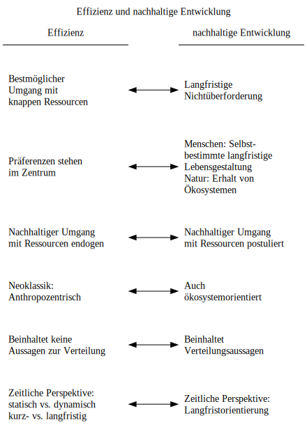
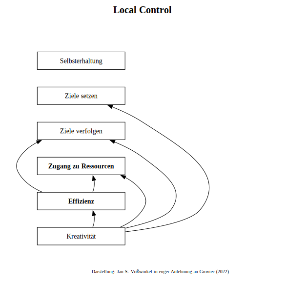

# Einleitung

## Fragestellungen

-   Was ist Effizienz und warum ist sie wichtig?

- In welchem Verhältnis steht die effiziente Nutzung von Ressourcen zur nachhaltigen Entwicklung?

- Wovon hängt es ab, ob Ressourcen effizient alloziiert werden?

-   Wie wird die effiziente Nutzung von Ressourcen ökonomisch analysiert?

- Wessen Handlungen wollen wir analysieren?

  - Individuen
  - Unternehmen
  - staatliche Akteure
  - $\dots$

## Begriff Effizienz

### Abgrenzung

- **Effektivität**:  
  - Fähigkeit, ein Ziel zu erreichen/Zielerreichungsgrad  
  - $\frac{\textrm{Ergebnis}}{\textrm{Ziel}}$
  - Mögliche Übersetzung: Wirksamkeit

- **Effizienz:**  
  - Verhältnis von Ergebnis und Einsatz  
  - $\frac{\textrm{Ergebnis}}{\textrm{Einsatz}}$

- Eine Strategie kann effektiv aber ineffizient sein (Mit Kanonen auf Spatzen schießen)  
- Eine Strategie kann grundsätzlich effizient aber ineffektiv sein (z.B. mangelnde Skalierung)

- Für **langfristige Lösungen** ist Effizienz von großer Bedeutung, da sonst Ressourcen verschwendet werden und sich Strategien nicht durchhalten lassen.

[Hier Priddat u accelerating growth]::


### Einzel- und volkswirtschaftliche Perspektive

```{python}
#| message: false
#| warning: false
#| fig-cap: "Einzel- und volkswirtschaftliche Perspektive"

import graphviz
from IPython.display import display

def create_perspective_comparison_graph():
    dot = graphviz.Digraph('PerspektivenVergleich', comment='BWL vs VWL')

    # Design für Übersichtlichkeit (A4/Bildschirm optimiert)
    dot.attr(rankdir='TB', size='8,11', nodesep='0.5', ranksep='0.7')
    dot.attr('node', fontname='Helvetica', style='filled, rounded', shape='rect', fontsize='11')

    # Wurzel
    dot.node('Root', 'Wirtschaftswissenschaften', fillcolor='#37474F', fontcolor='white')

    # Perspektive BWL
    with dot.subgraph(name='cluster_bwl') as b:
        b.attr(label='Betriebswirtschaft (BWL)\n"Die Einzelwirtschaft"', color='#1E88E5', style='dashed')
        b.node('BWL_Focus', 'Perspektive des Akteurs\n(Unternehmen von innen)', fillcolor='#BBDEFB')
        b.node('BWL_Goal', 'Gewinnmaximierung &\nWettbewerbsfähigkeit', fillcolor='#E3F2FD')
        b.node('BWL_Method', 'Managementwissenschaft\nEntscheidungstheorie', fillcolor='#E3F2FD')
        b.edge('BWL_Focus', 'BWL_Goal')
        b.edge('BWL_Goal', 'BWL_Method')

    # Perspektive VWL
    with dot.subgraph(name='cluster_vwl') as v:
        v.attr(label='Volkswirtschaft (VWL)\n"Die Wirtschaftsordnung"', color='#388E3C', style='dashed')
        v.node('VWL_Focus', 'Perspektive des Gestalters\n(Das System als Ganzes)', fillcolor='#C8E6C9')
        v.node('VWL_Goal', 'Gemeinwohl &\nGesamtwirtschaftliche Stabilität', fillcolor='#E8F5E9')
        v.node('VWL_Method', 'Mikro- & Makroökonomie\nOrdnungspolitik', fillcolor='#E8F5E9')
        v.edge('VWL_Focus', 'VWL_Goal')
        v.edge('VWL_Goal', 'VWL_Method')

    # Der Konflikt / Die Schnittstelle
    dot.node('Conflict', 'SPANNUNGSFELD\nEinzel- vs. Gesamtrationalität', shape='diamond', fillcolor='#FFF9C4')

    # Verbindungen
    dot.edge('Root', 'BWL_Focus')
    dot.edge('Root', 'VWL_Focus')

    dot.edge('BWL_Method', 'Conflict', label='Handeln', style='dotted')
    dot.edge('VWL_Method', 'Conflict', label='Regulierung', style='dotted')

    return dot

# Ausgabe
display(create_perspective_comparison_graph())
```


### Teilbereiche des Effizienzbegriffs

- Technische Effzienz  
- Kosteneffizienz  
- Allokative Effizienz


```{python}
#| message: false
#| warning: false
#| fig-cap: "Effektivität und Effizienz"

import graphviz
from IPython.display import display

def create_compact_efficiency_graph():
    dot = graphviz.Digraph('Kompakte_VWL_Effizienz', comment='Schlanke Darstellung')

    # Design-Attribute für bessere Lesbarkeit auf Bildschirmen
    dot.attr(rankdir='TB', size='8,11', nodesep='0.4', ranksep='0.6')
    dot.attr('node', fontname='Helvetica', style='filled, rounded', shape='rect', fontsize='12')

    # Wurzel
    dot.node('Root', 'Ökonomische Analyse', fillcolor='#37474F', fontcolor='white')

    # Ast 1: Effektivität
    dot.node('Effektiv', 'EFFEKTIVITÄT\n(Zielerreichung\n „Die richtigen Dinge tun“)', fillcolor='#E3F2FD', penwidth='2')
   # dot.node('Goal', '„Die richtigen Dinge tun“\n(Wirksamkeit)', shape='none', fontsize='10')

    # Ast 2: Effizienz
    dot.node('Effizienz', 'EFFIZIENZ\n(Mittel-Zweck-Relation\n „Die Dinge richtig tun“)', fillcolor='#E8F5E9', penwidth='2')
   # dot.node('Verschwendung', '„Die Dinge richtig tun“\n(Vermeidung von Verschwendung)', shape='none', fontsize='10')

    # Unterelemente Effizienz (Gruppiert für Übersichtlichkeit)
    with dot.subgraph(name='cluster_prinzipien') as c:
        c.attr(label='Prinzipien & Methoden', color='#9E9E9E', style='dotted', rankdir='TB')
        c.node('Rational', 'Rationalprinzip\n(Minimal- & Maximalprinzip)', fillcolor='#F1F8E9')
        c.node('Marginal', 'Marginalanalyse\n(Grenzkosten = Grenznutzen)', fillcolor='#F1F8E9')
        c.edge('Rational', 'Marginal', style='invis')

    with dot.subgraph(name='cluster_arten') as a:
        a.attr(label='Effizienz-Dimensionen', color='#9E9E9E', style='dotted', rankdir='TB')
        a.node('Allok', 'technische Effizienz,\n Kosteneffizienz und\n allokative Effizienz', fillcolor='#FFF9C4')
        a.node('Dyn', 'Statisch & Dynamisch\n(Kosten & Innovation)', fillcolor='#FFF9C4')
        a.edge('Allok', 'Dyn', style='invis')

    # Bewertung/Ideal
    dot.node('Pareto', 'Pareto-Optimum\n(Wohlfahrtsmaximum)', shape='egg', fillcolor='#D1C4E9')

    # Verbindungen
    dot.edge('Root', 'Effektiv')
    dot.edge('Root', 'Effizienz')

   # dot.edge('Effektiv', 'Goal', style='dotted', arrowhead='none')
   # dot.edge('Effizienz', 'Verschwendung', style='dotted', arrowhead='none')

    dot.edge('Effizienz', 'Rational')
    dot.edge('Effizienz', 'Marginal')
    dot.edge('Effizienz', 'Allok')
    dot.edge('Effizienz', 'Dyn')
    dot.edge('Dyn', 'Pareto', label='ZIEL')
    dot.edge('Marginal', 'Pareto', label='ZIEL')

    # dot.edge('Allok', 'Pareto', label='führt zu')

    return dot

display(create_compact_efficiency_graph())

```

:::{.callout-important 
    icon=false 
    collapse=true }
# Der Text zum Bild{-}

In der ökonomischen Theorie stellen Effektivität und Effizienz zwei grundlegende, jedoch voneinander abzugrenzende Maßstäbe zur Beurteilung von Handlungen und politischen Maßnahmen dar. Eine Maßnahme wird als effektiv bezeichnet, wenn sie tatsächlich dazu führt, dass ein zuvor angestrebtes Ziel erreicht wird, sie also eine reale Wirksamkeit entfaltet. Effektivität gibt somit darüber Auskunft, ob die gewählte Handlung grundsätzlich dazu geeignet ist, ein beabsichtigtes Ergebnis herbeizuführen. Im Unterschied dazu bezieht sich die Effizienz auf das Verhältnis zwischen dem erreichten Ziel und dem dafür notwendigen Aufwand. Eine Maßnahme gilt als effizient, wenn das gesetzte Ziel mit dem geringstmöglichen Einsatz an Ressourcen realisiert wird. Während die Effektivität die reine Zielerreichung betrachtet, steht bei der Effizienz die konsequente Vermeidung von Verschwendung im Mittelpunkt. 

In der Volkswirtschaftslehre wird dieser Anspruch auf Effizienz durch das ökonomische Prinzip oder Rationalprinzip präzisiert. Dieses Prinzip findet seine Anwendung in zwei Ausprägungen, dem Maximalprinzip und dem Minimalprinzip. Beim Maximalprinzip wird versucht, mit einem fest vorgegebenen Einsatz an Ressourcen ein maximales Maß an Zielerfüllung oder Output zu generieren. Das Minimalprinzip hingegen setzt ein bestimmtes Zielniveau voraus und strebt dessen Erreichung mit dem geringstmöglichen Einsatz an Mitteln an. Effizienz wird in diesem Zusammenhang oft als die Abwesenheit von Rentenverschwendung verstanden, wobei Ressourcen so gelenkt werden, dass sie ihren produktivsten Verwendungen zufließen.

Ein zentrales Konzept zur Bewertung der Effizienz von Allokationen ist die Pareto-Effizienz. Ein Zustand wird dann als pareto-effizient bezeichnet, wenn es nicht mehr möglich ist, ein Individuum besserzustellen, ohne gleichzeitig ein anderes Individuum schlechter zu stellen. Dieser Maßstab dient als wichtiges Kriterium in der Wohlfahrtsökonomik, um die Güte von Marktergebnissen zu beurteilen. In einem vollkommenen Wettbewerbsmarkt führt das Marktgleichgewicht  zu einer solchen effizienten Allokation, da hierbei die Summe aus Konsumentenrente und Produzentenrente maximiert wird. Jede Abweichung von diesem Gleichgewichtszustand geht mit Wohlfahrtsverlusten einher und wird daher als ineffizient gewertet.

Darüber hinaus unterscheidet die ökonomische Analyse zwischen statischer und dynamischer Effizienz. Statische Effizienz liegt vor, wenn eine bestimmte Menge an Gütern unter den aktuell gegebenen technologischen Bedingungen zu den geringstmöglichen volkswirtschaftlichen Kosten produziert wird. Dynamische Effizienz hingegen betrachtet die Fähigkeit eines Marktes oder einer Volkswirtschaft, durch Innovationen und technischen Fortschritt langfristige Produktivitätssteigerungen zu erzielen. Während eine rein dirigistische Auflage zwar ein Umweltziel effektiv erreichen kann, bieten marktorientierte Instrumente wie Abgaben oft höhere Effizienzvorteile, da sie Anreize zur kontinuierlichen Kostensenkung durch Forschung und Entwicklung setzen.

Allokative Effizienz beschreibt, ob die produzierten Güter den tatsächlichen Präferenzen der Konsumenten entsprechen und somit den gesellschaftlichen Nutzen maximieren. Der Wettbewerb übernimmt hierbei eine wichtige Steuerungsfunktion, indem er die Produktionsfaktoren in die bedarfsgerechtesten Einsatzrichtungen lenkt. Die produktive Effizienz wiederum bezieht sich darauf, dass Güter mit dem technisch geringstmöglichen Einsatz an knappen Ressourcen hergestellt werden. Unternehmen streben nach diesem Ziel, indem sie im Rahmen ihrer Gewinnmaximierung die Minimalkostenkombination der Produktionsfaktoren wählen.

Die Problematik der Effektivität zeigt sich häufig in der Wirtschaftspolitik, wenn Maßnahmen zwar implementiert werden, aber das beabsichtigte Problem nicht lösen oder sogar verschlimmern. Ein klassisches Beispiel hierfür ist die Einführung der Gurtpflicht im Straßenverkehr, die zunächst zu einem Anstieg der Unfälle führte, da die Fahrer aufgrund der Sicherheitsvorkehrung unvorsichtiger wurden. Eine solche Maßnahme ist zwar vorhanden, erweist sich jedoch als ineffektiv, da sie das Ziel der Schadensminderung verfehlt. Ähnliche Ineffektivitäten können bei staatlichen Regulierungen auftreten, wenn diese Marktpreise verzerren und dadurch Fehlallokationen von Ressourcen hervorrufen.

Für die Realisierung effizienter Ergebnisse spielt die Marginalanalyse eine entscheidende Rolle. Ökonomen vergleichen hierbei die Grenzkosten einer zusätzlichen Einheit mit ihrem Grenznutzen oder Grenzerlös. Eine Entscheidung ist dann effizient, wenn die Aktivität genau bis zu dem Punkt ausgedehnt wird, an dem der zusätzliche Nutzen den zusätzlichen Kosten entspricht. Jede Ausweitung über diesen Punkt hinaus wäre ineffizient, da die Kosten der nächsten Einheit ihren Nutzen übersteigen würden. Die Orientierung an Grenzgrößen zieht sich durch sämtliche Optimierungsprobleme in der Mikro- und Makroökonomik.

:::

 X-University:

 <blockquote class="twitter-tweet" data-dnt="true"><p lang="de" dir="ltr">Ein extremes Beispiel: Wenn wir es bei der Ernährung nur auf technische Effizienz ankommen ließen, müssten wir uns fragen, wie wir 2.500 kcal pro Tag mit möglichst geringem Aufwand in jeden Menschen bekommen.<br><br>1/ <a href="https://t.co/VomTcc7cLS">https://t.co/VomTcc7cLS</a></p>&mdash; Jan Schnellenbach 🇺🇦🇺🇦 (@schnellenbachj) <a href="https://twitter.com/schnellenbachj/status/1631930349826588672?ref_src=twsrc%5Etfw">March 4, 2023</a></blockquote> <script async src="https://platform.twitter.com/widgets.js" charset="utf-8"></script> 


```{python}
#| message: false
#| warning: false
#| fig-cap: "Herausforderung Effizienz"

import graphviz
from IPython.display import display

def create_sustainability_system():
    dot = graphviz.Digraph('NachhaltigkeitsSystem', comment='Efficiency and Global Justice')
    dot.attr(rankdir='TB', size='10,8')
    dot.attr('node', shape='rectangle', style='rounded,filled', fontname='Arial')

    # Zentrale Grenze
    dot.node('Limits', 'Planetare Grenzen\n(Belastungsgrenze der Erde)', color='red', fillcolor='mistyrose')

    # Ressourcen-Ebene
    with dot.subgraph(name='cluster_resources') as r:
        r.attr(label='Knappe Ressourcen', color='blue')
        r.node('Mat', 'Materielle Rohstoffe')
        r.node('Time', 'Zeit & Aufmerksamkeit')
        r.node('Info', 'Valide Informationen')

    # Das Werkzeug
    dot.node('Eff', 'Effizienter Umgang\n& Technologische Intelligenz', color='green', fillcolor='honeydew', penwidth='2')

    # Die Wirkung (Entkopplung)
    dot.node('Decouple', 'Entkopplung\n(Wohlstand ohne Mehrverbrauch)', shape='ellipse', color='darkgreen')

    # Globale Ziele
    dot.node('West', 'Erhalt des Wohlstands\n(Industrialisierte Welt)', fillcolor='lightgray')
    dot.node('South', 'Wirtschaftliches Wachstum\n(Globaler Süden / Ärmere Regionen)', fillcolor='gold')

    # Verbindungen
    dot.edge('Limits', 'Mat', label='definiert Verfügbarkeit')
    dot.edge('Mat', 'Eff', label='erfordert')
    dot.edge('Time', 'Eff')
    dot.edge('Info', 'Eff')

    dot.edge('Eff', 'Decouple', label='ermöglicht')

    dot.edge('Decouple', 'West', label='sichert')
    dot.edge('Decouple', 'South', label='schafft Raum für')

    dot.edge('South', 'Limits', label='innerhalb bleiben', style='dashed', color='darkgreen')
    dot.edge('West', 'Limits', label='darf nicht überschreiten', style='dashed', color='darkgreen')

    return dot

# Zum Generieren:
# create_sustainability_system().render('global_efficiency_system', format='png', cleanup=True)
display(create_sustainability_system())
```


## Effizienz und nachhaltige Entwicklung 

```{python Nachhaltigkeit}
#| warning: false
#| message: false
#| include: false

from graphviz import Digraph
from IPython.display import display

dot = Digraph()

# Set common attributes for all nodes
dot.attr('node', width='2.5', shape='none')
dot.attr(nodesep='1.0')

dot.attr(label='Effizienz und nachhaltige Entwicklung', labelloc='t', labeljust='c')

# Main nodes A and B
dot.node('A', 'Effizienz', shape='underline', labeljust='c')
dot.node('B', 'nachhaltige Entwicklung', shape='underline', labeljust='c')

# Sub-nodes under A and B with text wrapping
sub_nodes_a = [
    'Bestmöglicher\l Umgang mit\l knappen Ressourcen\l',
    'Präferenzen stehen\l im Zentrum\l',
    'Nachhaltiger Umgang\l mit Ressourcen endogen\l',
    'Neoklassik:\l Anthropozentrisch\l',
    'Beinhaltet keine\l Aussagen zur Verteilung\l',
    'Zeitliche Perspektive:\l statisch vs. dynamisch\l kurz- vs. langfristig\l'
]

sub_nodes_b = [
    'Langfristige\l Nichtüberforderung\l',
    'Menschen: Selbst-\l bestimmte langfristige\l Lebensgestaltung\l Natur: Erhalt von \l Ökosystemen\l',
    'Nachhaltiger Umgang\l mit Ressourcen postuliert\l',
    'Auch\l ökosystemorientiert\l',
    'Beinhaltet\l Verteilungsaussagen\l',
    'Zeitliche Perspektive:\l Langfristorientierung\l'
]

# Create sub-nodes and align them
for i in range(len(sub_nodes_a)):
    a_node = f'A{i+1}'
    b_node = f'B{i+1}'

    dot.node(a_node, sub_nodes_a[i])
    dot.node(b_node, sub_nodes_b[i])

    # Positioning sub-nodes A[i] and B[i] in the same rank
    with dot.subgraph() as s:
        s.attr(rank='same')
        s.node(a_node)
        s.node(b_node)

    # Invisible edges to enforce vertical alignment of sub-nodes under A and B
    if i == 0:
        dot.edge('A', a_node, style='invis')
        dot.edge('B', b_node, style='invis')
    else:
        dot.edge(f'A{i}', a_node, style='invis')
        dot.edge(f'B{i}', b_node, style='invis')

    # Double arrows between corresponding sub-nodes
    dot.edge(a_node, b_node, dir='both')


# Diagramm im Notebook anzeigen
#display(dot)

#Datei erzeugen 
dot.format = 'svg'  # Format setzen
dot.render(filename='nachhaltigkeit', cleanup=True)  # Erzeugt output.svg
```




## Effizienz im Rahmen rationaler Entwicklung

[Local Control]::

```{python local-control}
#| warning: false
#| message: false
#| eval: true
#| include: false



```



## Bedeutung der Effizienz für Zukunftsherausforderungen

- Effizienz ist nicht (länger) eine nur wünschenswerte (aber auch verzichtbare) Forderung

- In Anbetracht begrenzter Ressourcen und begrenzter Kapazität der Atmosphäre ist **Effizienz** eine **notwendige Bedingung für künftigen Wohlstand** 

- Jeder Zuwachs der Verfügung über Ressourcen muss sich aus Effizienzsteigerungen speisen


## Wie erzeugt die Gesellschaft effiziente Ergebnisse?

```{python}
#| message: false
#| warning: false
#| fig-cap: "Wie wird Effizienz erzeugt?"

import graphviz
from IPython.display import display

def create_allocation_architecture():
    dot = graphviz.Digraph('OekonomischeAllokation', comment='Das Gefüge der VWL')
    dot.attr(rankdir='TB', size='12,12', nodesep='0.6', ranksep='0.8')
    dot.attr('node', fontname='Arial', style='filled', shape='rectangle', fontsize='11')

    # Zentrales Problem
    dot.node('Scarcity', 'DAS KNAPPHEITSPROBLEM\n(Unbegrenzte Bedürfnisse vs. begrenzte Güter)',
             shape='doubleoctagon', fillcolor='#ECEFF1', penwidth='2')

    # Koordinationsmechanismus
    dot.node('Market', 'MARKTMECHANISMUS\n(Preise als Knappheitssignale)',
             shape='diamond', fillcolor='#FFF9C4', penwidth='2')

    # Akteur 1: Konsumenten
    with dot.subgraph(name='cluster_cons') as c:
        c.attr(label='Konsumenten', color='#1E88E5', style='dashed')
        c.node('Cons', 'Nutzenmaximierung\nPräferenzsignale\nSoziale Verantwortung', fillcolor='#BBDEFB')

    # Akteur 2: Unternehmen
    with dot.subgraph(name='cluster_firms') as f:
        f.attr(label='Unternehmen', color='#388E3C', style='dashed')
        f.node('Firms', 'Gewinnmaximierung\nKosteneffizienz\nInnovation & Arbeitsteilung', fillcolor='#C8E6C9')

    # Akteur 3: Der Staat
    with dot.subgraph(name='cluster_state') as s:
        s.attr(label='Staat', color='#F4511E', style='dashed')
        s.node('State', 'Ordnungsrahmen\nMarktversagen korrigieren\nÖffentliche Güter', fillcolor='#FFCCBC')

    # Akteur 4: NGOs / NPOs
    with dot.subgraph(name='cluster_ngo') as n:
        n.attr(label='Zivilgesellschaft (NGOs)', color='#8E24AA', style='dashed')
        n.node('NGO', 'Überwachung & Moral\nÖffentliche Interessen\nNischen-Bereitstellung', fillcolor='#E1BEE7')

    # Zielzustand
    dot.node('Efficiency', 'PARETO-EFFIZIENZ\n(Maximale Rentensumme,\nminimale Verschwendung)',
             shape='egg', fillcolor='#D1C4E9', penwidth='2')

    # Verbindungen
    dot.edge('Scarcity', 'Market', label='erfordert Koordination')

    dot.edge('Cons', 'Market', label='Nachfrage')
    dot.edge('Firms', 'Market', label='Angebot')

    dot.edge('State', 'Market', label='Regulierung / Korrektur')
    dot.edge('NGO', 'Firms', label='Moralischer Druck')
    dot.edge('NGO', 'State', label='Erzeugt Öffentlichkeit')
    dot.edge('NGO', 'Cons', label='Meinungsbildung')

    dot.edge('Market', 'Efficiency', label='idealer Outcome')

    # Risiken
    dot.node('Failure', 'RISIKEN:\nMarktversagen\nStaatsversagen', shape='cloud', fillcolor='#FFCDD2', fontcolor='#B71C1C')
    dot.edge('Market', 'Failure', style='dotted')
    dot.edge('State', 'Failure', style='dotted')

    return dot

display(create_allocation_architecture())
```

